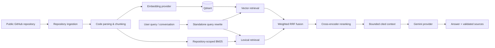

# Codebase RAG Assistant

Codebase RAG Assistant is a full-stack, repository-aware assistant for asking grounded questions about public GitHub codebases. It ingests source files, preserves code structure during chunking, indexes embeddings in Qdrant, combines semantic and lexical retrieval, reranks the result set, and generates Gemini answers with validated source citations.

It is designed to answer questions such as “Where is JWT authentication implemented?”, “Which files interact with Redis?”, or “How does this class work?” without claiming knowledge beyond the retrieved repository context.

## Problem

Large repositories are difficult to navigate through keyword search alone. Natural-language queries can miss exact identifiers, while pure semantic search can miss names such as `authenticateUser` or `JWT_SECRET`. This project combines code-aware ingestion, hybrid retrieval, reranking, and citation validation so an engineer can inspect both the answer and the source that supports it.

## Features

- Public GitHub repository ingestion with URL validation, temporary checkout cleanup, generated-file filtering, and configurable file/repository limits.
- Code-aware Python AST chunking, Markdown section chunking, and deterministic line-aware fallback chunking.
- Provider-independent batched embeddings and a configurable OpenAI-compatible embedding adapter.
- Qdrant cosine-vector storage with deterministic point IDs, repository isolation, metadata filters, and citation-ready payloads.
- Hybrid retrieval: Qdrant semantic search + code-aware BM25 identifier/path search + Reciprocal Rank Fusion.
- Optional local cross-encoder reranking that reduces candidates before generation.
- Grounded Gemini answer generation with bounded context and validated citations.
- Multi-turn query rewriting that turns follow-ups into standalone retrieval queries.
- Repository/file/symbol inspection and filtered code search.
- FastAPI production-style lifecycle, search, chat, health, and diagnostic endpoints.
- Next.js UI for indexing, repository exploration, chat, sources, and retrieval inspection.
- Retrieval and answer evaluation tooling with a curated fixture dataset and report writers.

## Architecture



The detailed repository-friendly diagram is also available in [docs/architecture.md](docs/architecture.md).

## RAG pipeline

1. Ingest a public GitHub repository without executing repository code.
2. Normalize supported source and documentation files.
3. Split files into semantic code/document chunks with line locations and symbols.
4. Generate vectors in batches and store them in Qdrant with repository metadata.
5. Retrieve candidates through vector search and BM25, then merge with Reciprocal Rank Fusion.
6. Rerank a bounded candidate set with a cross-encoder.
7. Build a citation-ID context window and ask Gemini for a grounded answer.
8. Validate cited IDs against retrieved chunks before returning source metadata.

## Tech stack

| Area | Technology |
| --- | --- |
| Backend | Python, FastAPI, Pydantic |
| Frontend | Next.js, React, TypeScript, CSS |
| Vector database | Qdrant with cosine similarity |
| Embeddings | Configurable OpenAI-compatible provider |
| Generation | Gemini REST API through a provider abstraction |
| Reranking | Configurable local `sentence-transformers` cross-encoder |
| Local infrastructure | Docker Compose |

## Setup

Prerequisites: Python 3.11+, Node.js 20+, Git, and Docker for the container workflow.

```powershell
Copy-Item .env.example .env
```

Populate only the provider credentials for features you plan to use. Never commit `.env`; it is ignored by Git.

### Backend

```powershell
cd backend
python -m venv .venv
.\.venv\Scripts\Activate.ps1
pip install -r requirements.txt
uvicorn app.main:app --reload
```

Run the backend suite:

```powershell
cd backend
pytest
```

### Frontend

```powershell
cd frontend
npm ci
npm run dev
```

Run checks:

```powershell
npm run typecheck
npm run build
```

Open `http://localhost:3000`.

### Docker Compose

```powershell
docker compose up --build
```

This starts Qdrant, FastAPI, and the Next.js production container. See [docs/deployment.md](docs/deployment.md) for ports, health checks, and a practical deployment topology.

## Environment variables

The complete documented template is [.env.example](.env.example). Important groups:

- `GEMINI_API_KEY`, `GEMINI_MODEL`: answer generation and conversation rewriting.
- `EMBEDDING_API_KEY`, `EMBEDDING_MODEL`, `EMBEDDING_BASE_URL`: vector creation.
- `QDRANT_URL`, `QDRANT_API_KEY`, `QDRANT_COLLECTION_NAME`: vector storage.
- `MAX_FILE_SIZE_BYTES`, `MAX_REPOSITORY_FILES`, `MAX_REPOSITORY_SIZE_BYTES`: ingestion safeguards.
- `*_MAX_RETRIES` and `*_INITIAL_BACKOFF_SECONDS`: bounded external-service retries.
- Retrieval, reranking, conversation, and context limits: behavior tuning without code changes.

## API documentation

FastAPI OpenAPI is available at `http://localhost:8000/docs`.

Key endpoints include:

- `POST /repositories/index`, `GET /repositories`, `GET /repositories/{id}/status`, `DELETE /repositories/{id}`
- `GET /repositories/{id}/files`, `GET /repositories/{id}/files/{path}`, `GET /repositories/{id}/symbols/{symbol}`
- `POST /repositories/search` and `POST /chat`
- `GET /health` and `GET /health/qdrant`

See [docs/api.md](docs/api.md) for endpoint behavior and lifecycle details.

## Evaluation

The repository contains a 30-question fixture dataset and repeatable comparison runner for Vector, Hybrid, and Hybrid + reranker retrieval. It computes Recall@1/3/5/10, MRR, and Precision@1/3/5/10, and can write JSON plus Markdown reports.

```powershell
cd backend
python -m app.evaluation_runner `
  --dataset ..\docs\evaluation\retrieval-evaluation-dataset.json `
  --repository-id evaluation-fixture `
  --repository-path tests\fixtures\evaluation_repository `
  --output ..\data\evaluation-results
```

### Actual evaluation results

No measured metrics are committed yet. The evaluation runner could not be executed in the current workspace because no Python interpreter is installed, and this project deliberately does not invent benchmark results. Once executed with configured providers and Qdrant, reports are written under `data/evaluation-results/` (ignored by Git). See [docs/evaluation.md](docs/evaluation.md) for methodology and LLM-as-judge limitations.

## Screenshots

Add screenshots after running the frontend locally:

1. Index a public repository and capture the ready repository explorer.
2. Ask a grounded question and capture the answer with citations.
3. Click a citation and capture the source panel with line-numbered code.

Suggested placement: `docs/screenshots/indexing.png`, `docs/screenshots/chat-citations.png`, and `docs/screenshots/source-panel.png`. No screenshots are committed because this workspace has not run the full backend/provider stack.

## Documentation map

- [Architecture](docs/architecture.md)
- [Chunking](docs/chunking-strategy.md), [embeddings](docs/embedding-pipeline.md), and [Qdrant storage](docs/qdrant-storage.md)
- [Hybrid retrieval](docs/hybrid-retrieval.md), [reranking](docs/reranking.md), and [semantic retrieval](docs/semantic-retrieval.md)
- [Generation](docs/generation-layer.md), [citations](docs/citations.md), and [conversation](docs/conversational-retrieval.md)
- [Code intelligence](docs/code-intelligence.md), [evaluation](docs/evaluation.md), [production hardening](docs/production-hardening.md), and [deployment](docs/deployment.md)

## Future improvements

- Move lifecycle and conversational state from process memory to durable storage.
- Replace FastAPI background indexing with a durable worker queue for multi-instance deployments.
- Add a verified streaming-answer protocol that preserves citation validation.
- Expand language-specific parsers and evaluation repositories.
- Add authentication and access control before indexing private repositories.

## Resume bullet candidates

- Built a full-stack repository-aware RAG assistant using FastAPI, Next.js, Qdrant, hybrid BM25/vector retrieval, cross-encoder reranking, and Gemini-based grounded answers with validated source citations.
- Designed code-aware GitHub ingestion and AST-based chunking with deterministic source metadata, repository isolation, configurable safety limits, and production-style indexing lifecycle APIs.
- Implemented repeatable retrieval evaluation tooling for vector, hybrid, and reranked pipelines, including Recall@K, MRR, precision, citation correctness, and machine-readable reports.
