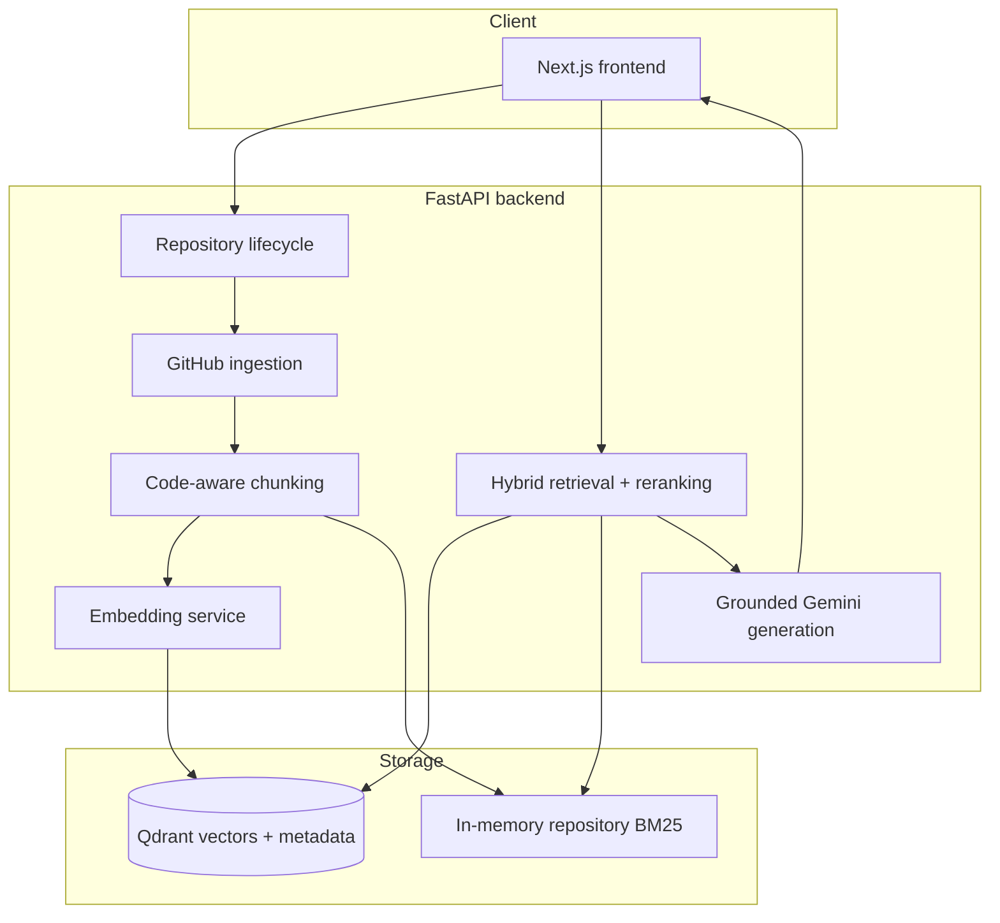

# Architecture

The monorepo keeps HTTP concerns in `backend/app/api`, configuration/logging/resilience in `backend/app/core`, typed models in `backend/app/models`, and domain integrations in `backend/app/services`. The frontend uses one typed API client rather than scattering network calls through components.

Repository content is treated as untrusted data throughout the flow; it is read and indexed but never executed.
